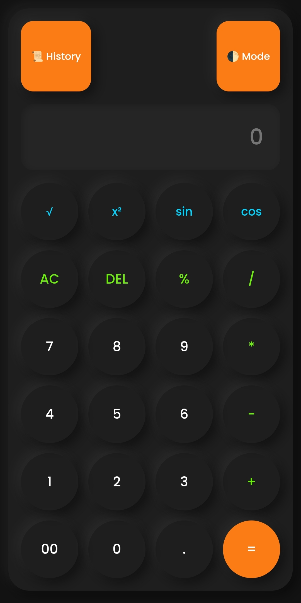
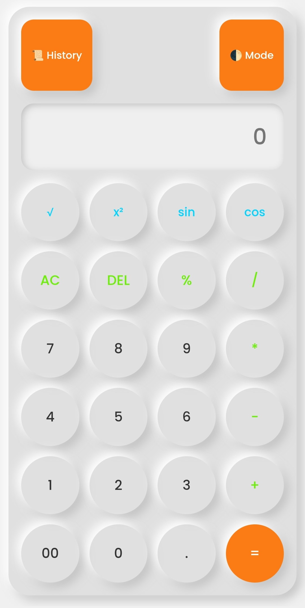

# 🧮 Calculator

A simple calculator built using **HTML, CSS, and JavaScript**.

---

## 🌐 Live Demo

[🚀 Click Here to Use Calculator](https://mdrajatech03.github.io/CALCULATOR/)

---

## 📸 Screenshot



---

## 🚀 Features

- ➕ Addition
- ➖ Subtraction
- ✖️ Multiplication
- ➗ Division
- 📱 Responsive Design

---

## 🛠 Tech Stack


---

## 📂 Project Structure

```
CALCULATOR
│
├── index.html
├── style.css
├── script.js
├── icon.png
└── README.md
```

---

## 👨‍💻 Author

**Rajatech**

GitHub: https://github.com/mdrajatech03
